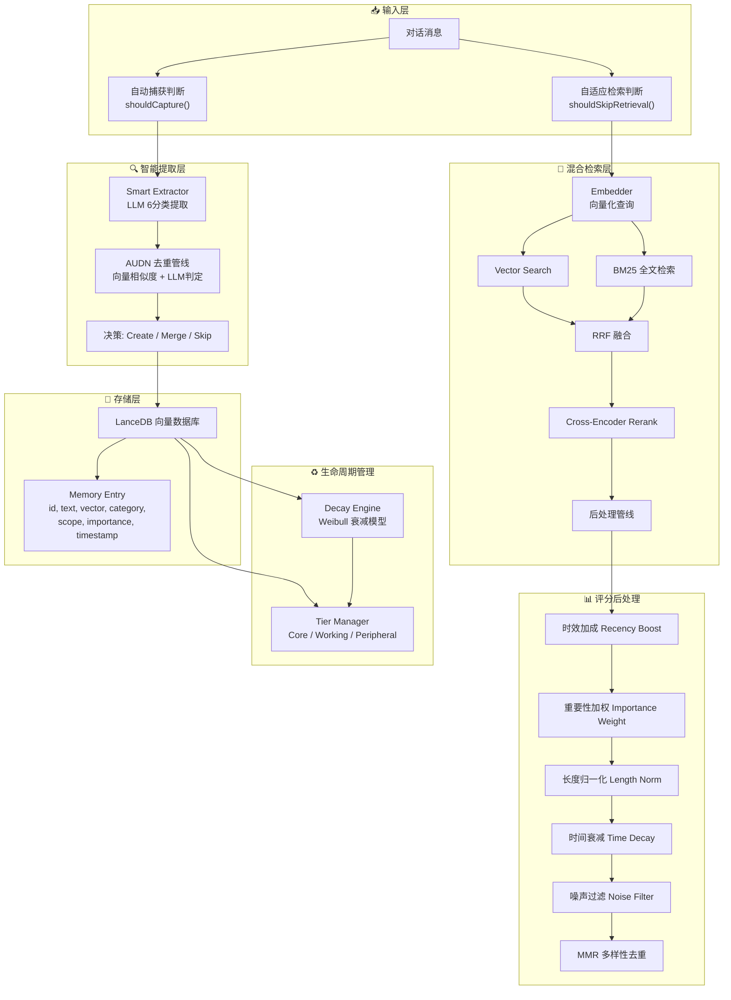
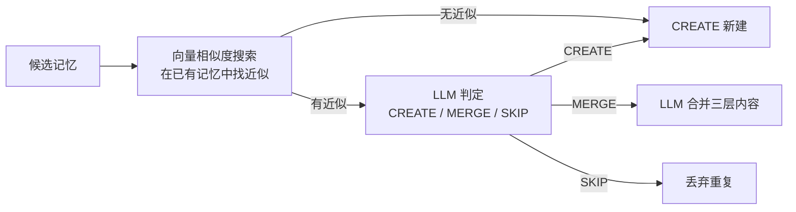
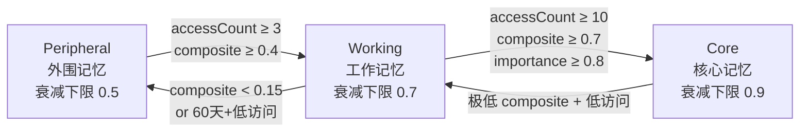

# 🧠 OpenClaw memory-lancedb-pro 记忆原理分析

## 架构总览



---

## 一、记忆写入：智能提取管线

### 1.1 自动捕获触发（Capture Trigger）

在 [index.ts](file:///c:/Users/CJY/work/agent-memory/memory-lancedb-pro/index.ts) 中定义正则触发器 `MEMORY_TRIGGERS`，匹配以下模式：

| 模式 | 示例 |
|------|------|
| 用户偏好 | "我喜欢…", "I prefer…" |
| 身份信息 | "我的名字是…", "叫我…" |
| 习惯/规律 | "总是…", "每次都…" |
| 重要原则 | "重要", "千万别…" |
| 保存指令 | "帮我存起来", "存档" |

同时用 `CAPTURE_EXCLUDE_PATTERNS` 排除对记忆系统本身的操作指令（删除/清理等）。

### 1.2 LLM 智能提取（Smart Extractor）

核心流程定义在 [smart-extractor.ts](file:///c:/Users/CJY/work/agent-memory/memory-lancedb-pro/src/smart-extractor.ts)：

```
对话文本 → LLM 提取候选记忆 → 逐条去重 → 持久化
```

**6 类记忆分类**（定义于 [memory-categories.ts](file:///c:/Users/CJY/work/agent-memory/memory-lancedb-pro/src/memory-categories.ts)）：

| 分类 | 含义 | 去重策略 |
|------|------|----------|
| `profile` | 用户身份（静态属性） | **始终合并** |
| `preferences` | 用户偏好（倾向性） | 支持合并 |
| `entities` | 持续存在的实体（项目/人/组织） | 支持合并 |
| `events` | 发生的事件/决策 | 仅追加 |
| `cases` | 问题→解决方案对 | 仅追加 |
| `patterns` | 可复用流程/模板 | 支持合并 |

**三层结构（L0/L1/L2）**：

| 层级 | 功能 | 内容 |
|------|------|------|
| **L0 abstract** | 一句话索引 | `[合并键]: [描述]` |
| **L1 overview** | 结构化Markdown摘要 | 按分类特定标题组织 |
| **L2 content** | 完整叙述 | 包含背景和细节 |

### 1.3 AUDN 去重管线

去重过程为两阶段判决（[smart-extractor.ts](file:///c:/Users/CJY/work/agent-memory/memory-lancedb-pro/src/smart-extractor.ts#L226-L247)）：



- `profile` 类记忆**跳过去重**，始终执行合并
- `events` / `cases` **不支持合并**，仅 CREATE 或 SKIP

---

## 二、记忆检索：混合检索管线

定义于 [retriever.ts](file:///c:/Users/CJY/work/agent-memory/memory-lancedb-pro/src/retriever.ts)，6 阶段评分管线：

### 2.1 双路检索 + RRF 融合

```
Query → [Vector Search] ──┐
                           ├── RRF 融合 → 候选池
Query → [BM25 Search]  ───┘
```

- **Vector Search**：Embedding 向量的余弦相似度搜索
- **BM25 Search**：LanceDB 原生全文索引，精确关键词匹配
- **融合公式**：`fusedScore = vectorScore + (hasBM25Hit × 0.15 × vectorScore)`

### 2.2 Cross-Encoder Rerank

支持 Jina / SiliconFlow / Voyage / Pinecone 四种 Rerank 提供商：

- **混合分数** = `crossEncoderScore × 0.6 + fusedScore × 0.4`
- 超时 5s 自动降级为余弦相似度 Rerank
- 降级公式 = `fusedScore × 0.7 + cosineSim × 0.3`

### 2.3 六阶段后处理评分

| 阶段 | 公式 | 作用 |
|------|------|------|
| ① 时效加成 | `score += exp(-ageDays / 14) × 0.10` | 新记忆加分 |
| ② 重要性加权 | `score *= 0.7 + 0.3 × importance` | 高重要性记忆优先 |
| ③ 长度归一化 | `score *= 1 / (1 + 0.5 × log2(len/500))` | 防止长文本霸占 |
| ④ 时间衰减 | `score *= 0.5 + 0.5 × exp(-ageDays / 60)` | 旧记忆惩罚（底线50%） |
| ⑤ 噪声过滤 | 正则匹配拒绝/寒暄/元问题 | 剔除低质量记忆 |
| ⑥ MMR 去重 | 余弦相似度 > 0.85 降权 | 保证结果多样性 |

### 2.4 自适应检索守卫

[adaptive-retrieval.ts](file:///c:/Users/CJY/work/agent-memory/memory-lancedb-pro/src/adaptive-retrieval.ts) 在检索前**判断是否需要触发记忆查询**：

- **跳过**：问候语、系统命令、单词确认、emoji
- **强制触发**：包含 "remember/recall/上次/之前" 等关键词
- CJK 文本最低 6 字符，拉丁文本最低 15 字符

---

## 三、记忆生命周期：衰减 + 分层

### 3.1 Weibull 衰减引擎

定义于 [decay-engine.ts](file:///c:/Users/CJY/work/agent-memory/memory-lancedb-pro/src/decay-engine.ts)，综合评分公式：

```
compositeScore = 0.4 × recency + 0.3 × frequency + 0.3 × intrinsic
```

| 维度 | 模型 | 说明 |
|------|------|------|
| **Recency** | Weibull 拉伸指数衰减 | [exp(-λ × daysSince^β)](file:///c:/Users/CJY/work/agent-memory/memory-lancedb-pro/src/scopes.ts#259-262)，重要记忆半衰期更长 |
| **Frequency** | 对数饱和曲线 | `1 - exp(-accessCount / 5)` + 访问间隔奖励 |
| **Intrinsic** | 固有价值 | `importance × confidence` |

**Weibull β 按层级不同**：

| 层级 | β值 | 衰减行为 | 衰减下限 |
|------|-----|----------|----------|
| Core | 0.8 | 亚指数衰减（**慢**） | 0.9 |
| Working | 1.0 | 标准指数衰减 | 0.7 |
| Peripheral | 1.3 | 超指数衰减（**快**） | 0.5 |

### 3.2 三层记忆分级（Tier Manager）

定义于 [tier-manager.ts](file:///c:/Users/CJY/work/agent-memory/memory-lancedb-pro/src/tier-manager.ts)：



- **Peripheral → Working**：访问≥3次 且 综合分≥0.4
- **Working → Core**：访问≥10次 且 综合分≥0.7 且 重要性≥0.8
- **Working → Peripheral**：综合分<0.15 或超60天低访问 降级
- **Core → Working**：极端场景才降级

---

## 四、辅助系统

### 4.1 Multi-Scope 隔离

[scopes.ts](file:///c:/Users/CJY/work/agent-memory/memory-lancedb-pro/src/scopes.ts) 提供 5 种 Scope 模式：

- `global`：所有 Agent 共享
- `agent:<id>`：Agent 私有记忆
- `project:<id>`：按项目隔离
- `user:<id>`：按用户隔离
- `custom:<name>`：自定义隔离域

### 4.2 长文本分块

[chunker.ts](file:///c:/Users/CJY/work/agent-memory/memory-lancedb-pro/src/chunker.ts) 在文本超过 Embedding 模型上下文窗口时自动分块：
- 默认 4000 字符/块，200 字符重叠
- 优先在句子边界/换行处分割（语义分割）
- 分块平均向量作为文档 Embedding

### 4.3 Embedding 缓存

[embedder.ts](file:///c:/Users/CJY/work/agent-memory/memory-lancedb-pro/src/embedder.ts) 内置 LRU 缓存：
- 最大 256 条，TTL 30 分钟
- 支持 task-aware embedding（区分 query/passage 任务类型）

---

## 五、核心文件索引

| 文件 | 职责 |
|------|------|
| [index.ts](file:///c:/Users/CJY/work/agent-memory/memory-lancedb-pro/index.ts) | 插件入口，生命周期钩子，自动捕获/回忆 |
| [smart-extractor.ts](file:///c:/Users/CJY/work/agent-memory/memory-lancedb-pro/src/smart-extractor.ts) | LLM 智能提取 + 去重管线 |
| [extraction-prompts.ts](file:///c:/Users/CJY/work/agent-memory/memory-lancedb-pro/src/extraction-prompts.ts) | 提取/去重/合并 Prompt 模板 |
| [retriever.ts](file:///c:/Users/CJY/work/agent-memory/memory-lancedb-pro/src/retriever.ts) | 混合检索 + Rerank + 后处理 |
| [store.ts](file:///c:/Users/CJY/work/agent-memory/memory-lancedb-pro/src/store.ts) | LanceDB 存储层（CRUD + 向量/BM25搜索） |
| [decay-engine.ts](file:///c:/Users/CJY/work/agent-memory/memory-lancedb-pro/src/decay-engine.ts) | Weibull 衰减模型 |
| [tier-manager.ts](file:///c:/Users/CJY/work/agent-memory/memory-lancedb-pro/src/tier-manager.ts) | 三层晋升/降级系统 |
| [memory-categories.ts](file:///c:/Users/CJY/work/agent-memory/memory-lancedb-pro/src/memory-categories.ts) | 6 类记忆分类定义 |
| [scopes.ts](file:///c:/Users/CJY/work/agent-memory/memory-lancedb-pro/src/scopes.ts) | 多 Scope 访问控制 |
| [embedder.ts](file:///c:/Users/CJY/work/agent-memory/memory-lancedb-pro/src/embedder.ts) | Embedding 抽象层 + 缓存 |
| [adaptive-retrieval.ts](file:///c:/Users/CJY/work/agent-memory/memory-lancedb-pro/src/adaptive-retrieval.ts) | 自适应检索守卫 |
| [noise-filter.ts](file:///c:/Users/CJY/work/agent-memory/memory-lancedb-pro/src/noise-filter.ts) | 噪声/低质量记忆过滤 |
| [chunker.ts](file:///c:/Users/CJY/work/agent-memory/memory-lancedb-pro/src/chunker.ts) | 长文本语义分块 |
